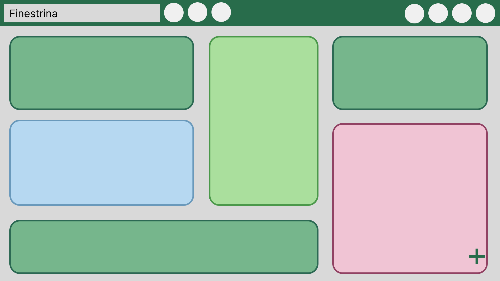

# Finestrini
Finestrini je klientská webová aplikace pro rychlé psaní a grafickou organizaci poznámek.

## Funkční specifikace
Uživatel má k dispozici Finestrini workspace, který je ukládán do místního úložiště prohlížeče. Z tohoto vyplývá, že aplikace má pouze jednu uživatelskou roli - Uživatel.
Kromě ukládání do místního úložiště které se děje automaticky po provedených změnách, má uživatel také možnost exportovat si Finestrini workspace do externího souboru a později si ho opět importovat.
Samotný workspace se skládá z tzv. nástěnek, tj. plocha na kterou je možné ukládat své poznámky v podobě barevných lístečků. Nástěnky a lístečky může uživatel libovolně spravovat.
### Grafický návrh
Na obrázcích níže je znázorněn a popsán návrh rozložení Finestrini workspace.

### Use Case
Use Case znázorňuje funkce aplikace Finestrini z pohledu uživatele.  
  
Bližší pohled na jednotlivé use case nabízí Use Case specifikace níže (či v [PDF](./docs/Finestrini%20UseCase%20specification.pdf) a [Excel](./docs/Finestrini%20UseCase.xlsx)).

## Technická specifikace

### Datový logický model
Obrázek níže obsahuje datový logický model znázorněný pomocí Entity-relationship modelu zapsaném v Chen-notation.  
  
